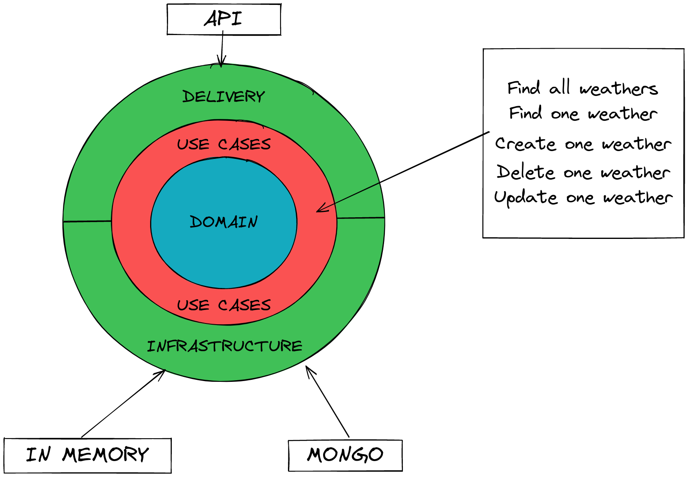
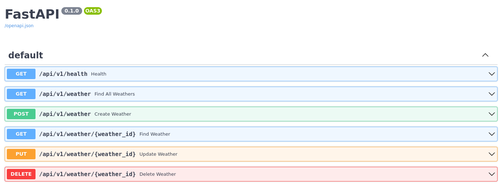

# Domain Driven Design example using Python

## Components
The app is build upon **docker** and **docker-compose**. The main webapp is a Python docker application
connected to a Mongo database using docker-compose.

This repository is a work in progress exercise applying **DDD** to a weather app.

The app exposes an API endpoint included in the **Delivery** layer, this layer talks
with the **Use Cases** layer using command handlers.

This command handlers talks with the **Infrastructure** and **Domain** layers and returns
the result to the **Delivery** layer again.

## Design

## App Layers
- Delivery: API Rest using FastAPI.
- Infrastructure: MongoDB and PyMongo.
- Use Cases: CommandHandlers.
- Domain: Domain objects.

## API endpoints

The docs are available at [http://localhost:8080/docs](http://localhost:8080/docs).

- GET     - `/health`: status of the app.
- GET     - `/api/v1/weather`: list the weather in all cities in the database.
- GET     - `/api/v1/weather/:id`: gets the weather of a given city.
- POST    - `/api/v1/weather`: creates a weather in the database.
- DELETE  - `/api/v1/weather/:id`: deletes the weather of a given city.
- UPDATE  - `/api/v1/weather/:id`: updates the weather of a given city.

## How to run the app 

- `make run`

## How to run the server

- `make dev`

## How to test it

- `make test`
