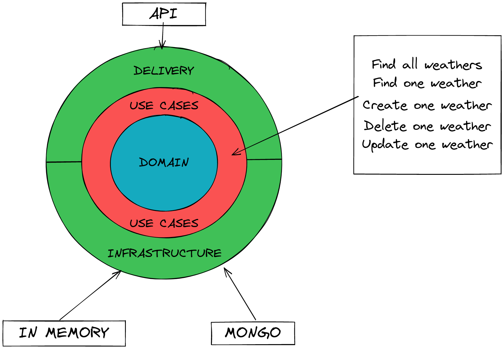

# Domain Driven Design example using Python

This repository is a work in progress exercise applying DDD to a weather app.

The app exposes an API endpoint included in the Delivery layer, this layer talks
with the Use Cases layer using command handlers.

This command handlers talks with the Infrastructure and Domain layers and returns
the result to the Delivery layer again.

## Design

## Components
- Delivery: API Rest using FastAPI.
- Infrastructure: MongoDB.
- Use Cases: CommandHandlers.
- Domain: Domain objects.

## API endpoints
- `/health`: status of the app.
- `/api/v1/weather`: list the weather in all cities in the database.
- `/api/v1/weather/:id`: get the weather of a given city.
